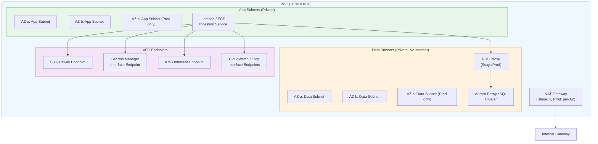
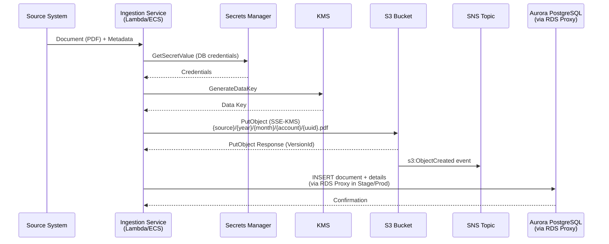
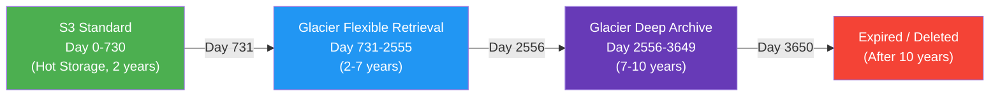
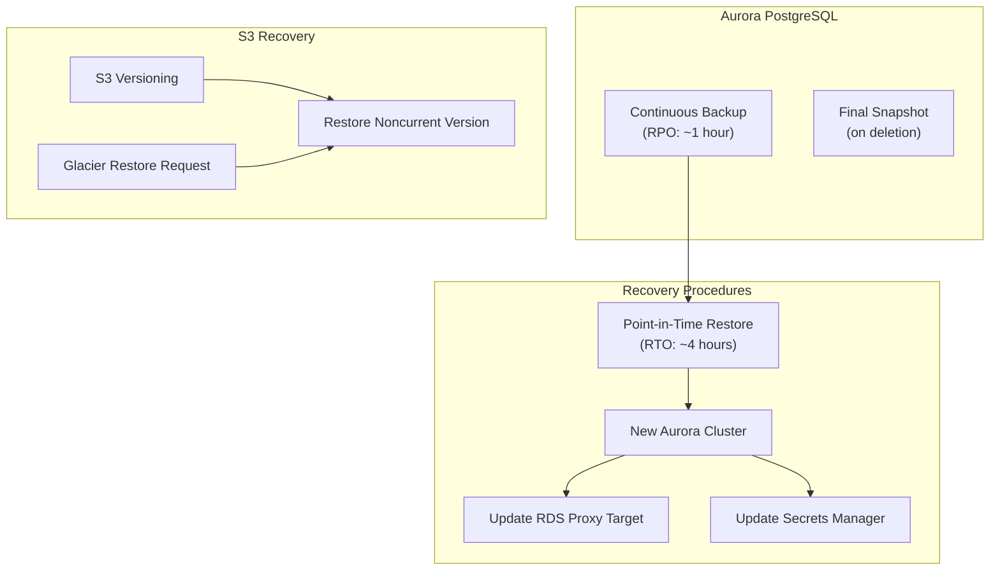
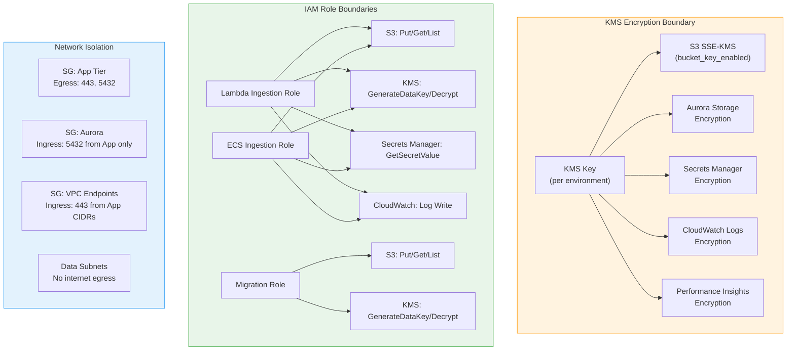

# Architecture

## Environment Topology

Each environment (QA, Stage, Prod) follows the same topology with differences
in scale (AZ count, NAT gateways, instance sizes).

### Environment Differences

| Component | QA | Stage | Prod |
|---|---|---|---|
| VPC CIDR | 10.10.0.0/16 | 10.20.0.0/16 | 10.30.0.0/16 |
| Availability Zones | 2 | 2 | 3 |
| NAT Gateways | 0 | 1 (shared) | 3 (one per AZ) |
| Aurora Instances | 1x db.t4g.medium | 2x db.t4g.large | 2x db.r8g.large |
| RDS Proxy | No | Yes | Yes |
| S3 Object Lock | No | No | Yes (GOVERNANCE) |
| Performance Insights | No | Yes | Yes |
| Log Retention | 90 days | 90 days | 365 days |
| Backup Retention | 7 days | 14 days | 35 days |

## Ingestion Data Flow

## S3 Storage Tier Lifecycle

### Noncurrent Version Lifecycle

| Days After Becoming Noncurrent | Action |
|---|---|
| 30 | Transition to Glacier Instant Retrieval |
| 365 | Expire (delete) |

Incomplete multipart uploads are aborted after 7 days.

## Backup and Recovery Flow

## Security Boundary Diagram

