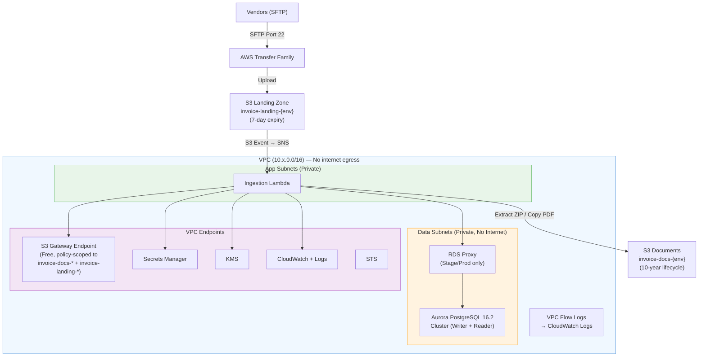
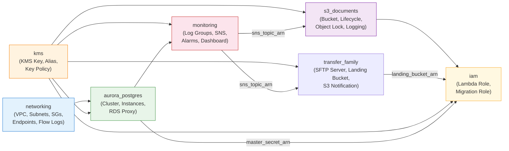
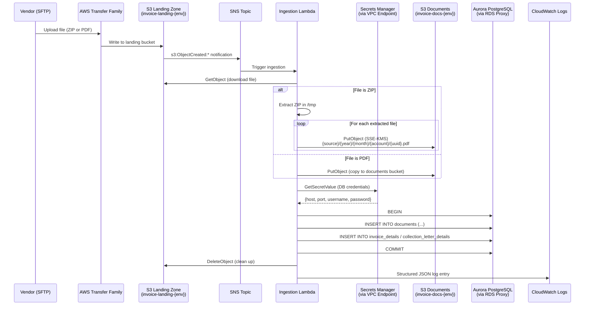
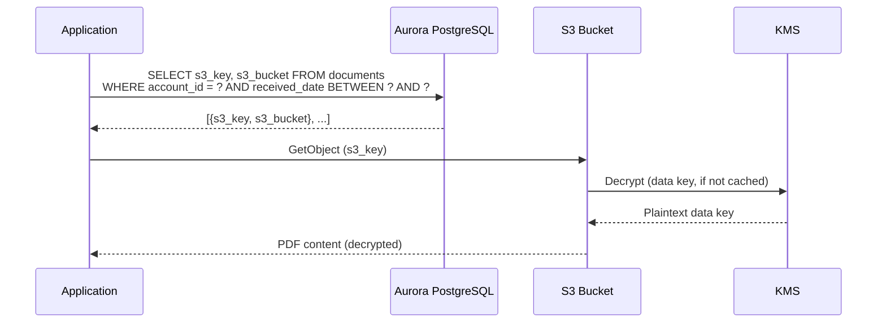
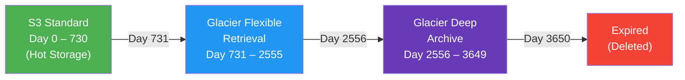
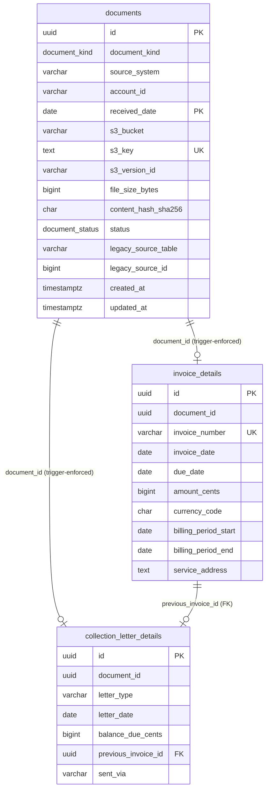
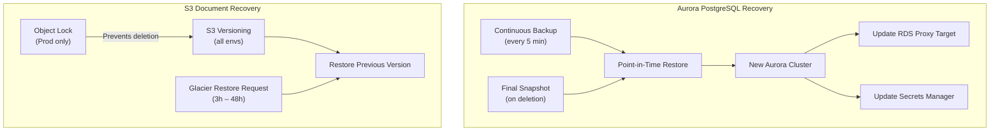
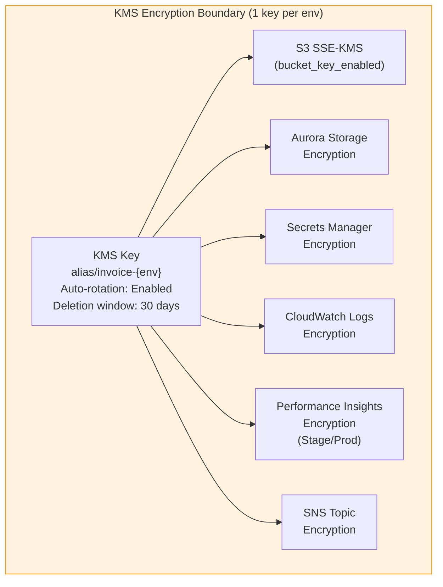
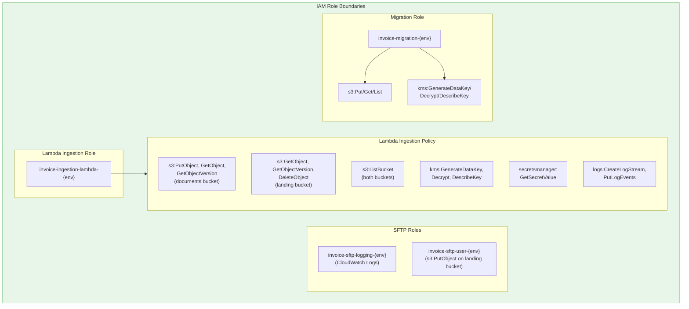
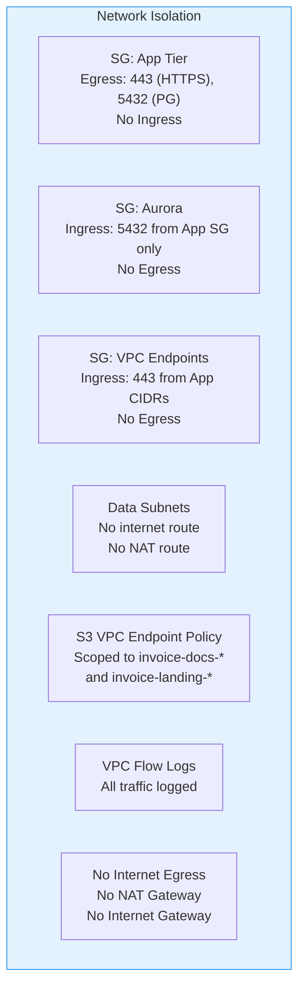

# Architecture

This document describes the system architecture for the Invoice Document Storage platform, including network topology, data flow, storage lifecycle, backup/recovery, and security boundaries.

## Table of Contents

- [System Overview](#system-overview)
- [Environment Topology](#environment-topology)
- [Module Dependency Graph](#module-dependency-graph)
- [Ingestion Data Flow](#ingestion-data-flow)
- [Document Retrieval Flow](#document-retrieval-flow)
- [S3 Storage Tier Lifecycle](#s3-storage-tier-lifecycle)
- [Network Architecture](#network-architecture)
- [Database Architecture](#database-architecture)
- [Backup and Recovery](#backup-and-recovery)
- [Security Boundaries](#security-boundaries)
- [Encryption Architecture](#encryption-architecture)
- [Monitoring Architecture](#monitoring-architecture)

## System Overview

The Invoice Document Storage platform replaces a legacy Windows Server-based system with a cloud-native AWS architecture. Documents (PDFs) are stored in Amazon S3 with metadata in Aurora PostgreSQL. The system serves three primary workloads:

1. **Ingestion** — Vendors drop files (PDFs or ZIPs) via SFTP into a landing zone S3 bucket. A Lambda function extracts ZIPs, writes individual documents to the permanent S3 documents bucket, and inserts metadata into Aurora
2. **Retrieval** — Documents are queried by account ID, date range, or invoice number, with the PDF fetched from S3
3. **Migration** — Legacy documents are bulk-migrated from Windows file shares (via DataSync) and SQL Server (via Python ETL)

## Environment Topology

Each environment (QA, Stage, Prod) follows the same topology with differences in scale (AZ count, instance sizes).



### Environment Differences

| Component | QA | Stage | Prod |
|---|---|---|---|
| VPC CIDR | 10.10.0.0/16 | 10.20.0.0/16 | 10.30.0.0/16 |
| Availability Zones | 2 | 2 | 3 |
| Internet Egress | None (VPC endpoints only) | None (VPC endpoints only) | None (VPC endpoints only) |
| Aurora Instances | 1x db.t4g.medium | 2x db.t4g.large | 2x db.r8g.large |
| RDS Proxy | No | Yes | Yes |
| S3 Object Lock | No | No | Yes (GOVERNANCE mode, 3650 days) |
| Performance Insights | No | Yes (KMS-encrypted) | Yes (KMS-encrypted) |
| Deletion Protection | No (Aurora) | Yes (Aurora) | Yes (Aurora) |
| Backup Retention | 7 days | 14 days | 35 days |
| Log Retention | 90 days | 90 days | 365 days |
| Max Connections Alarm Threshold | 170 | 272 | 3200 |

## Module Dependency Graph

Terraform modules are organized to avoid circular dependencies. The `kms` module uses a root-admin key policy that delegates permission control to IAM policies, breaking the KMS <-> IAM circular dependency.



**Key dependency decisions:**
- `monitoring.s3_bucket_name` receives the bucket name as a hardcoded string (`"invoice-docs-${var.env}"`) rather than a module reference, breaking the S3 <-> Monitoring cycle
- `kms` key policy grants `kms:*` to root account, delegating actual permissions to IAM policies attached to each role

## Ingestion Data Flow



### Data Flow Notes

- **Two-bucket design** — Vendors upload to a transient landing zone bucket (`invoice-landing-{env}`, 7-day expiry). Lambda extracts ZIPs and writes processed files to the permanent documents bucket (`invoice-docs-{env}`, 10-year lifecycle with Object Lock in Prod)
- **No internet egress** — All VPC traffic uses VPC endpoints (S3 Gateway, Secrets Manager, KMS, CloudWatch, STS). No NAT Gateway or Internet Gateway exists
- **RDS Proxy** (Stage/Prod) pools connections and handles failover transparently. The Lambda connects to the proxy endpoint; the proxy forwards to the Aurora writer
- **S3 Bucket Keys** reduce KMS API calls by ~99% — S3 generates per-object keys locally using a bucket-level key, avoiding a KMS API call per PutObject
- **Structured JSON logging** via CloudWatch ensures all ingestion events are searchable and parseable

## Document Retrieval Flow



### Storage Class Considerations for Retrieval

| Storage Class | Access Time | Cost per Retrieval |
|---|---|---|
| S3 Standard (day 0-730) | Immediate (milliseconds) | Free |
| Glacier Flexible Retrieval (day 731-2555) | 3-5 hours (Standard), 5-12 hours (Bulk) | $0.01/GB + per-request fee |
| Glacier Deep Archive (day 2556-3649) | 12 hours (Standard), 48 hours (Bulk) | $0.02/GB + per-request fee |

Documents in Glacier or Deep Archive require a restore request before they can be downloaded. See [OPERATIONS.md](OPERATIONS.md) runbooks 2 and 3 for detailed restore procedures.

## S3 Storage Tier Lifecycle



### Current Version Lifecycle

| Day Range | Storage Class | Access Speed | Relative Cost |
|---|---|---|---|
| 0 – 730 (2 years) | S3 Standard | Instant | $$$ |
| 731 – 2555 (2-7 years) | Glacier Flexible Retrieval | 3-12 hours | $$ |
| 2556 – 3649 (7-10 years) | Glacier Deep Archive | 12-48 hours | $ |
| 3650+ (10+ years) | Expired / Deleted | N/A | Free |

### Noncurrent Version Lifecycle

When a document is overwritten (new version uploaded), the previous version follows a separate lifecycle:

| Days After Becoming Noncurrent | Action |
|---|---|
| 30 | Transition to Glacier Instant Retrieval |
| 365 | Expire (permanently delete) |

**Incomplete multipart uploads** are automatically aborted after 7 days.

### Object Lock (Prod Only)

Production uses S3 Object Lock in **GOVERNANCE mode** with a 3650-day (10-year) retention period. This prevents accidental deletion or overwriting of documents. Users with `s3:BypassGovernanceRetention` permission can override if absolutely necessary.

## Network Architecture

### Subnet Layout

Each availability zone has two private subnets. There are no public subnets, no NAT Gateways, and no Internet Gateway — all AWS service access uses VPC endpoints.

| Subnet Tier | CIDR Pattern | Purpose | Internet Access |
|---|---|---|---|
| App | x.x.{1,2,3}.0/24 | Lambda ingestion service | None (VPC endpoints only) |
| Data | x.x.{11,12,13}.0/24 | Aurora PostgreSQL, RDS Proxy | None (local VPC only) |

### VPC Endpoints

| Endpoint | Type | Purpose | Policy |
|---|---|---|---|
| S3 | Gateway (free) | Document and landing bucket access | Scoped to `invoice-docs-*` and `invoice-landing-*` buckets; actions include `s3:GetObject`, `s3:PutObject`, `s3:DeleteObject`, `s3:ListBucket` |
| Secrets Manager | Interface | Aurora credential retrieval | Default (full access) |
| KMS | Interface | Encryption key operations | Default (full access) |
| CloudWatch Monitoring | Interface | Metric publishing | Default (full access) |
| CloudWatch Logs | Interface | Log streaming | Default (full access) |
| STS | Interface | IAM role assumption (Lambda, Transfer Family) | Default (full access) |

### Security Groups

| Security Group | Ingress | Egress | Attached To |
|---|---|---|---|
| `sg-app` | None | HTTPS (443) to 0.0.0.0/0, PostgreSQL (5432) to sg-aurora | Lambda |
| `sg-aurora` | PostgreSQL (5432) from sg-app only | None | Aurora, RDS Proxy |
| `sg-vpc-endpoints` | HTTPS (443) from app subnet CIDRs | None | Interface VPC Endpoints |

### VPC Flow Logs

All VPC traffic (ACCEPT and REJECT) is logged to a dedicated CloudWatch Log Group (`/aws/vpc/invoice-vpc-{env}/flow-logs`) with 90-day retention. A dedicated IAM role (`invoice-vpc-flow-logs-{env}`) grants the Flow Logs service write access.

## Database Architecture

### Partitioning Strategy

The `documents` table is partitioned by `received_date` using PostgreSQL RANGE partitioning with yearly boundaries:

```
documents (parent)
├── documents_y2015  (2015-01-01 to 2016-01-01)
├── documents_y2016  (2016-01-01 to 2017-01-01)
├── ...
├── documents_y2026  (2026-01-01 to 2027-01-01)
└── documents_default (catch-all for dates outside defined ranges)
```

A `create_yearly_partition()` function automatically creates new yearly partitions. The schema deployment also pre-creates next year's partition.

### Table Relationships



See [DATABASE.md](DATABASE.md) for complete schema documentation.

## Backup and Recovery

### Aurora PostgreSQL

| Aspect | Details |
|---|---|
| Continuous Backup | Automatic, every 5 minutes |
| Retention | QA: 7 days, Stage: 14 days, Prod: 35 days |
| Point-in-Time Restore (PITR) | Restore to any second within retention window |
| Final Snapshot | Created automatically on cluster deletion (Stage/Prod) |
| RPO | ~5 minutes (continuous backup) |
| RTO | ~4 hours (PITR restore + validation + Proxy/Secrets update) |

### S3 Documents

| Aspect | Details |
|---|---|
| Versioning | Enabled (all environments) |
| Object Lock | GOVERNANCE mode, 3650 days (Prod only) |
| Cross-Region Replication | Not configured (add if DR requirement emerges) |
| Recovery from Accidental Delete | Restore previous version via S3 versioning |
| Recovery from Glacier | 3-12 hours (Flexible Retrieval), 12-48 hours (Deep Archive) |



## Security Boundaries

### Encryption Boundary

A single KMS key per environment encrypts all data at rest:



### IAM Boundary



### Network Boundary



## Encryption Architecture

### Data at Rest

| Service | Encryption Method | Key |
|---|---|---|
| S3 Documents | SSE-KMS with S3 Bucket Keys | `alias/invoice-{env}` |
| Aurora PostgreSQL | Storage-level encryption | `alias/invoice-{env}` |
| Secrets Manager | Envelope encryption | `alias/invoice-{env}` |
| CloudWatch Logs | Log group encryption | `alias/invoice-{env}` |
| Performance Insights | PI encryption | `alias/invoice-{env}` |
| SNS Topics | Topic encryption | `alias/invoice-{env}` |

### Data in Transit

| Path | Encryption |
|---|---|
| Client -> S3 | HTTPS enforced via bucket policy (Deny on `aws:SecureTransport=false`) |
| Client -> Aurora | SSL enforced via `rds.force_ssl=1` parameter |
| Client -> RDS Proxy | TLS required (`require_tls = true`) |
| VPC Endpoint traffic | HTTPS (Interface Endpoints use TLS) |

### KMS Key Policy

The KMS key policy follows the **root admin delegation** pattern:

1. **Root Account Admin** — `kms:*` on the key (delegates to IAM policies)
2. **RDS Service** — `kms:CreateGrant`, `kms:ListGrants`, `kms:RevokeGrant` (for Aurora encryption)
3. **CloudWatch Logs Service** — `kms:Encrypt`, `kms:Decrypt`, `kms:GenerateDataKey*`, `kms:DescribeKey`
4. **Deny Non-Root Key Deletion** — Explicit deny on `kms:ScheduleKeyDeletion` for non-root principals

## Monitoring Architecture

### CloudWatch Alarms

| Alarm | Metric | Threshold | Period |
|---|---|---|---|
| `aurora-cpu-high-{env}` | CPUUtilization | > 80% | 5 min |
| `aurora-storage-high-{env}` | FreeLocalStorage | < 20 GB | 5 min |
| `aurora-connections-high-{env}` | DatabaseConnections | > 80% of max | 5 min |
| `aurora-replica-lag-high-{env}` | AuroraReplicaLag | > 10,000 ms | 5 min |
| `s3-5xx-errors-{env}` | 5xxErrors | > 5 per period | 5 min |
| `kms-throttles-{env}` | ThrottleCount | > 10 per period | 5 min |

All alarms send notifications to the `invoice-alerts-{env}` SNS topic, which forwards to the configured email address. Both ALARM and OK transitions are notified.

### CloudWatch Dashboard

The `invoice-{env}` dashboard provides 6 widgets:

1. Aurora CPU Utilization (line chart)
2. Aurora Database Connections (line chart)
3. Aurora Replica Lag (line chart)
4. S3 Request Counts + 5xx Errors (stacked)
5. KMS Throttle Count (bar chart)
6. Aurora Free Local Storage (line chart)

### Log Groups

| Log Group | Purpose | Retention | Encrypted |
|---|---|---|---|
| `/invoice/application/{env}` | Ingestion service logs | 90d (QA/Stage), 365d (Prod) | Yes (KMS) |
| `/invoice/aurora/{env}` | Aurora PostgreSQL logs | 90d (QA/Stage), 365d (Prod) | Yes (KMS) |
| `/invoice/migration/{env}` | ETL and DataSync logs | 90d (QA/Stage), 365d (Prod) | Yes (KMS) |
| `/aws/vpc/invoice-vpc-{env}/flow-logs` | VPC Flow Logs | 90 days | No |
