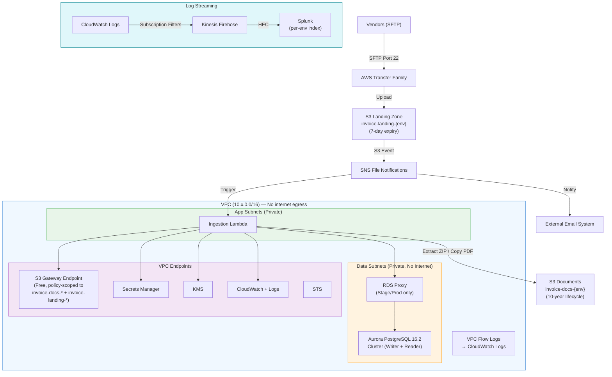
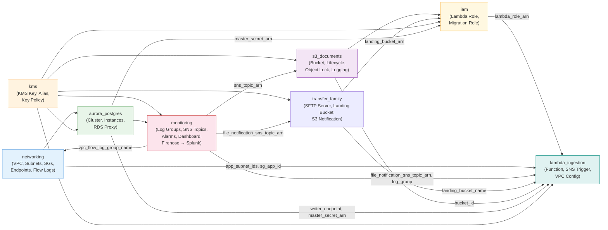
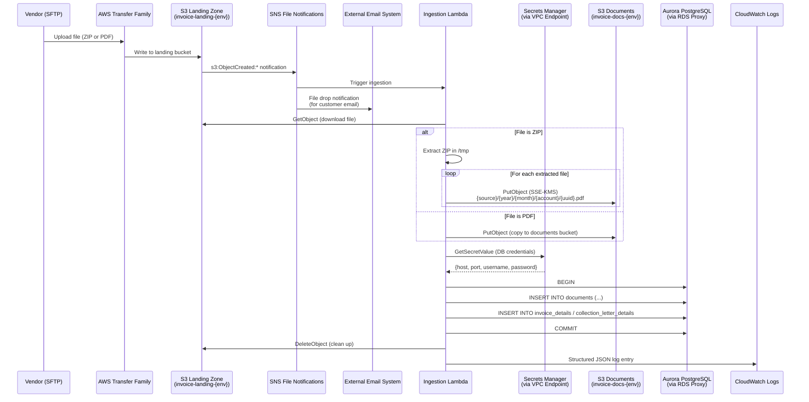
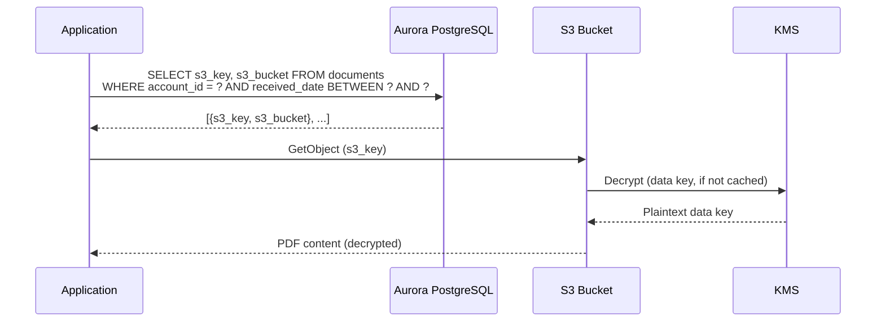
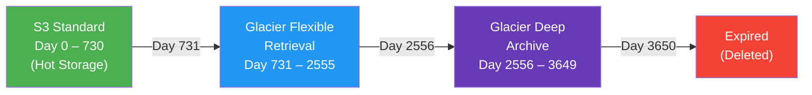
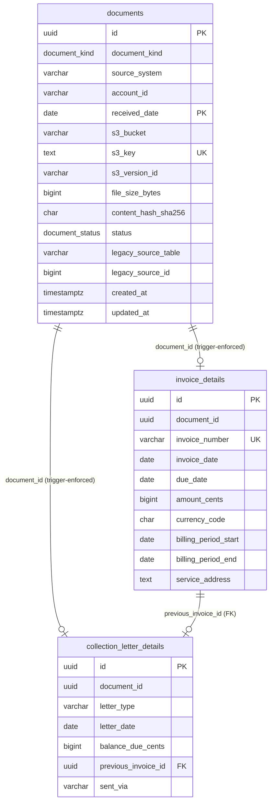
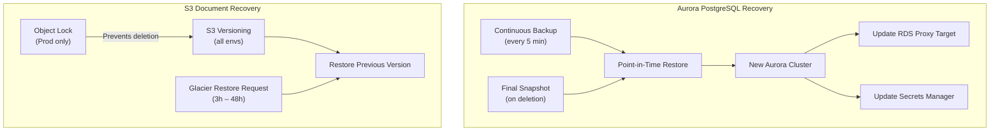
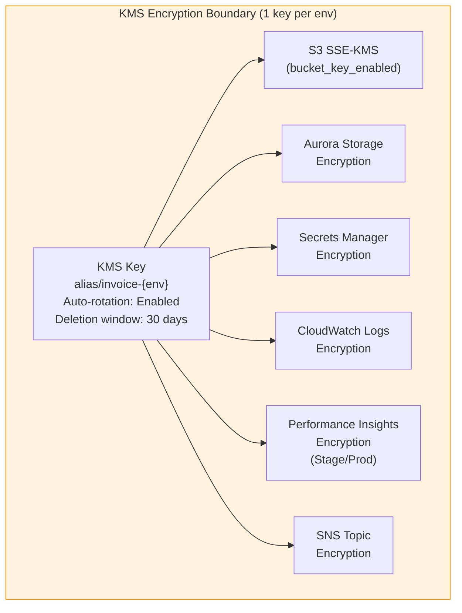
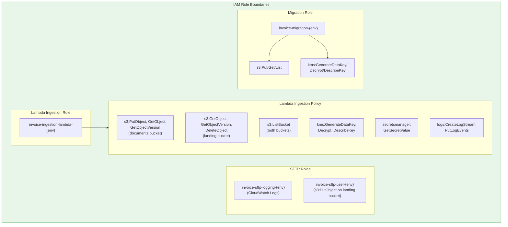
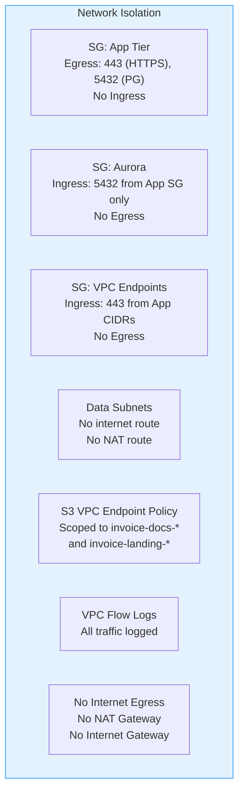

# Architecture

This document describes the system architecture for the Invoice Document Storage platform, including network topology, data flow, storage lifecycle, backup/recovery, and security boundaries.

## Table of Contents

- [System Overview](#system-overview)
- [Component Reference](#component-reference)
- [End-to-End Component Flow](#end-to-end-component-flow)
- [Environment Topology](#environment-topology)
- [Module Dependency Graph](#module-dependency-graph)
- [Ingestion Data Flow](#ingestion-data-flow)
- [Document Retrieval Flow](#document-retrieval-flow)
- [S3 Storage Tier Lifecycle](#s3-storage-tier-lifecycle)
- [Network Architecture](#network-architecture)
- [Database Architecture](#database-architecture)
- [Backup and Recovery](#backup-and-recovery)
- [Security Boundaries](#security-boundaries)
- [Encryption Architecture](#encryption-architecture)
- [Monitoring Architecture](#monitoring-architecture)

## System Overview

The Invoice Document Storage platform replaces a legacy Windows Server-based system with a cloud-native AWS architecture. Documents (PDFs) are stored in Amazon S3 with metadata in Aurora PostgreSQL. The system serves three primary workloads:

1. **Ingestion** — Vendors drop files (PDFs or ZIPs) via SFTP into a landing zone S3 bucket. A Lambda function extracts ZIPs, writes individual documents to the permanent S3 documents bucket, and inserts metadata into Aurora
2. **Retrieval** — Documents are queried by account ID, date range, or invoice number, with the PDF fetched from S3
3. **Migration** — Legacy documents are bulk-migrated from Windows file shares (via DataSync) and SQL Server (via Python ETL)

## Component Reference

This section documents every component shown in the architecture diagram, why it exists, and what problem it solves.

### External Components

#### Vendors (SFTP Clients)

| Attribute | Details |
|---|---|
| **What it is** | External vendor systems that upload invoice documents (PDFs or ZIP bundles) |
| **Why it's needed** | Vendors are the primary source of new invoice documents. They need a standard, secure file transfer mechanism that doesn't require VPN access or custom integrations |
| **Protocol** | SFTP (SSH File Transfer Protocol) over port 22 |
| **Authentication** | SSH key-based via AWS Transfer Family SERVICE_MANAGED identity provider |

#### On-Premises Legacy Server

| Attribute | Details |
|---|---|
| **What it is** | The existing Windows Server hosting a file share (PDFs) and SQL Server (metadata) |
| **Why it's needed** | During migration, bulk document files are transferred from the legacy file share to S3 via AWS DataSync through the SFTP endpoint. After migration is complete, this component is decommissioned |
| **Lifecycle** | Temporary — active only during the migration phase |

#### External Email System

| Attribute | Details |
|---|---|
| **What it is** | A downstream system that receives file drop notifications and sends confirmation emails to customers |
| **Why it's needed** | When a vendor uploads an invoice, the customer needs to be notified that their document has been received. The platform itself does not send emails — it publishes an SNS notification that the external email system subscribes to, maintaining separation of concerns |
| **Integration** | Subscribes to the `invoice-file-notifications-{env}` SNS topic (HTTPS, SQS, or Lambda subscription) |

#### Splunk (Per-Environment Index)

| Attribute | Details |
|---|---|
| **What it is** | Centralized log management and SIEM platform |
| **Why it's needed** | CloudWatch Logs provides basic log storage and search, but the operations team requires centralized log correlation across all AWS services, long-term retention beyond CloudWatch limits, advanced alerting rules, and integration with the organization's existing incident response workflows. Each environment streams to its own Splunk index for isolation |
| **Integration** | Receives logs via Kinesis Data Firehose using Splunk HTTP Event Collector (HEC) |
| **Index mapping** | QA → `invoice_qa`, Stage → `invoice_stage`, Prod → `invoice_prod` |

### Ingestion Pipeline

#### AWS Transfer Family (SFTP Server)

| Attribute | Details |
|---|---|
| **What it is** | Fully managed SFTP server that accepts file uploads and writes them directly to S3 |
| **Why it's needed** | Vendors require a standard SFTP endpoint for file delivery. Transfer Family provides this without running EC2 instances, managing SSH daemons, or opening inbound ports on the VPC. It maps SFTP operations directly to S3 API calls, eliminating the need for an intermediate file server |
| **Alternative considered** | Self-hosted SFTP on EC2 — rejected because it requires patching, HA configuration, and NAT/IGW for public access. Transfer Family is fully managed and serverless |
| **Endpoint type** | PUBLIC (vendor-accessible over the internet without VPN) |
| **Terraform module** | `transfer_family` |

#### S3 Landing Zone Bucket (`invoice-landing-{env}`)

| Attribute | Details |
|---|---|
| **What it is** | Transient S3 bucket that receives raw uploads from SFTP before processing |
| **Why it's needed** | Separating the upload target from the permanent document store solves three problems: (1) **ZIP handling** — vendors may upload ZIP files containing multiple PDFs; the Lambda extracts these before writing to the documents bucket. (2) **Object Lock conflict** — the documents bucket uses GOVERNANCE Object Lock in Prod, which would prevent the Lambda from deleting processed ZIPs. A separate bucket without Object Lock allows cleanup. (3) **Event loop prevention** — if Lambda wrote to the same bucket that triggers it, S3 events would create an infinite loop |
| **Encryption** | SSE-KMS with the same environment KMS key |
| **Lifecycle** | 7-day expiration (safety net for unprocessed files), 1-day multipart abort |
| **S3 Event** | `s3:ObjectCreated:*` → SNS File Notifications topic |

#### SNS File Notifications Topic (`invoice-file-notifications-{env}`)

| Attribute | Details |
|---|---|
| **What it is** | Dedicated SNS topic that receives S3 ObjectCreated events from the landing zone bucket |
| **Why it's needed** | This topic serves as a fan-out mechanism for file drop events. When a file arrives in the landing zone: (1) The **Lambda function** is triggered to process the file (extract ZIP, store documents, insert metadata). (2) The **external email system** receives the same notification to send a customer confirmation email. A dedicated topic keeps file events separate from infrastructure alerts (which go to the `invoice-alerts-{env}` topic) |
| **Subscribers** | Ingestion Lambda (for processing), external email system (for customer notification) |
| **Encryption** | KMS-encrypted with the environment key |

#### Ingestion Lambda (`invoice-ingestion-{env}`)

| Attribute | Details |
|---|---|
| **What it is** | AWS Lambda function triggered by SNS when files land in the landing zone bucket |
| **Why it's needed** | The core processing engine for the ingestion pipeline. It handles: (1) Downloading the file from the landing zone. (2) Extracting ZIP archives into individual PDFs. (3) Writing each document to the permanent documents bucket with the correct S3 key convention. (4) Inserting document metadata into Aurora PostgreSQL. (5) Deleting the processed file from the landing zone |
| **Alternative considered** | ECS Fargate tasks — removed because Lambda's event-driven model is a better fit for the bursty, file-triggered workload. No long-running containers needed |
| **Runtime** | Python 3.12, JSON structured logging |
| **VPC attachment** | Deployed in app subnets (private) to access Aurora via RDS Proxy and S3 via VPC Gateway Endpoint |
| **IAM role** | `invoice-ingestion-lambda-{env}` — cross-bucket: `GetObject`+`DeleteObject` on landing bucket, `PutObject`+`GetObject` on documents bucket, plus KMS, Secrets Manager, and CloudWatch Logs. Also attached: `AWSLambdaVPCAccessExecutionRole` for ENI management |
| **SNS trigger** | Subscribed to `invoice-file-notifications-{env}` topic with `lambda:InvokeFunction` permission |
| **Terraform module** | `lambda_ingestion` — deploys with a stub handler; CI/CD pipeline replaces with real code |

### Document Storage

#### S3 Documents Bucket (`invoice-docs-{env}`)

| Attribute | Details |
|---|---|
| **What it is** | The permanent storage location for all invoice documents (PDFs) |
| **Why it's needed** | S3 provides virtually unlimited, highly durable (11 9s) object storage at low cost. Lifecycle tiering automatically moves older documents to cheaper storage classes (Glacier → Deep Archive), reducing storage costs by up to 23x over 10 years. Versioning protects against accidental overwrites, and Object Lock (Prod) prevents deletion for compliance |
| **Encryption** | SSE-KMS with S3 Bucket Keys (reduces KMS API calls by ~99%) |
| **Lifecycle** | Standard (0-2 yr) → Glacier Flexible Retrieval (2-7 yr) → Deep Archive (7-10 yr) → Expire |
| **Object Lock** | GOVERNANCE mode, 3650 days (Prod only) |
| **Key convention** | `{source_system}/{year}/{month}/{account_id}/{document_uuid}.pdf` |

#### S3 Access Logs Bucket (`invoice-docs-{env}-access-logs`)

| Attribute | Details |
|---|---|
| **What it is** | Dedicated bucket that receives server access logs from the documents bucket |
| **Why it's needed** | S3 server access logging provides an audit trail of every GET, PUT, DELETE, HEAD, and LIST operation on the documents bucket. This is required for compliance auditing, forensic investigation of unauthorized access, and tracking document retrieval patterns. A separate bucket prevents self-referencing logging loops |
| **Retention** | 90-day lifecycle expiration |
| **Prefix** | `s3-access-logs/` |

### Database Layer

#### Aurora PostgreSQL Writer

| Attribute | Details |
|---|---|
| **What it is** | The primary (writer) instance of the Aurora PostgreSQL 16.2 cluster |
| **Why it's needed** | Stores all document metadata — S3 locations, account IDs, invoice details, collection letter details, and legacy mapping data. Aurora was chosen over standard RDS PostgreSQL because it provides: (1) Up to 5x throughput improvement. (2) Storage auto-scaling up to 128 TiB. (3) Continuous backup with point-in-time restore to any second. (4) Faster failover (typically < 30 seconds). The partitioned `documents` table supports the expected 10-year document retention with efficient range queries by `received_date` |
| **Encryption** | Storage-level KMS encryption, SSL enforced (`rds.force_ssl = 1`) |
| **Placement** | Data subnets (no internet route) |

#### Aurora PostgreSQL Reader

| Attribute | Details |
|---|---|
| **What it is** | Read replica instance in the Aurora cluster (Stage/Prod: 2 instances total) |
| **Why it's needed** | Offloads read-heavy queries (document lookups, reporting, BI) from the writer instance. In Prod, the reader also serves as an automatic failover target — if the writer fails, Aurora promotes the reader within ~30 seconds. QA uses a single instance (no reader) to reduce costs |

#### RDS Proxy

| Attribute | Details |
|---|---|
| **What it is** | Fully managed database proxy that sits between Lambda and Aurora |
| **Why it's needed** | Lambda functions can spawn hundreds of concurrent connections, each opening a new PostgreSQL connection. Without a proxy, this can exhaust Aurora's `max_connections` limit and cause connection storms. RDS Proxy: (1) Pools and reuses database connections (reducing connection overhead by 10-100x). (2) Handles failover transparently (Lambda doesn't need to reconnect). (3) Manages credential rotation — when Secrets Manager rotates the Aurora password, the proxy picks up new credentials automatically |
| **Availability** | Stage and Prod only (QA has low concurrency, so direct connections suffice) |
| **TLS** | `require_tls = true` |

### Network Components

#### VPC (`invoice-vpc-{env}`)

| Attribute | Details |
|---|---|
| **What it is** | Virtual Private Cloud providing network isolation for all compute and database resources |
| **Why it's needed** | The VPC provides a logically isolated network segment within AWS. All resources (Lambda, Aurora, RDS Proxy) run inside private subnets with no internet access. This ensures that document data never traverses the public internet, database ports are not exposed externally, and all traffic is logged via VPC Flow Logs. The VPC CIDR is unique per environment to support potential VPC peering |
| **CIDR** | QA: `10.10.0.0/16`, Stage: `10.20.0.0/16`, Prod: `10.30.0.0/16` |
| **Internet egress** | None — no NAT Gateway, no Internet Gateway |

#### VPC Endpoints

The platform uses 6 VPC endpoints to provide private connectivity to AWS services without requiring internet access:

| Endpoint | Type | Why It's Needed |
|---|---|---|
| **S3 Gateway** | Gateway (free) | Provides free, high-throughput access to the documents and landing zone S3 buckets from within the VPC. Without this endpoint, S3 traffic would need to traverse a NAT Gateway ($0.045/GB). The endpoint policy is scoped to `invoice-docs-*` and `invoice-landing-*` buckets only, preventing workloads from accessing other S3 buckets |
| **Secrets Manager** | Interface | Lambda retrieves Aurora database credentials from Secrets Manager on each cold start. Without this endpoint, the Lambda would need internet access (via NAT Gateway) to reach the Secrets Manager API |
| **KMS** | Interface | Every S3 PutObject/GetObject with SSE-KMS encryption requires KMS API calls (`GenerateDataKey`, `Decrypt`). The KMS endpoint keeps these calls within the VPC. S3 Bucket Keys reduce the call volume by ~99%, but the endpoint is still required for the remaining calls |
| **CloudWatch Logs** | Interface | Lambda writes structured JSON logs to CloudWatch Logs after each invocation. Without this endpoint, log delivery from VPC-attached Lambda functions would fail (no internet route) |
| **CloudWatch Monitoring** | Interface | Enables publishing custom CloudWatch metrics from within the VPC. Used by Lambda and other services for operational metric publishing |
| **STS** | Interface | Lambda and Transfer Family need to call `sts:AssumeRole` to obtain temporary credentials for their IAM roles. Without this endpoint, role assumption would fail in the VPC (no internet route). This was the last endpoint added to eliminate the NAT Gateway entirely |

#### VPC Flow Logs

| Attribute | Details |
|---|---|
| **What it is** | Captures metadata about all IP traffic (ACCEPT and REJECT) flowing through the VPC's network interfaces |
| **Why it's needed** | Flow Logs provide visibility into network traffic patterns for: (1) **Security investigation** — detecting unexpected connections, port scans, or data exfiltration attempts. (2) **Connectivity debugging** — identifying REJECT traffic when security groups or NACLs block legitimate connections. (3) **Compliance auditing** — proving that no internet-bound traffic leaves the VPC. Logs are streamed to CloudWatch Logs and then to Splunk via Firehose |
| **Log group** | `/aws/vpc/invoice-vpc-{env}/flow-logs` |
| **Retention** | 90 days |

### Security and Encryption

#### KMS Key (`alias/invoice-{env}`)

| Attribute | Details |
|---|---|
| **What it is** | A single symmetric AES-256 KMS key per environment that encrypts all data at rest |
| **Why it's needed** | A single key simplifies key management while providing encryption for all services: S3 (documents + landing zone), Aurora storage, Secrets Manager secrets, CloudWatch Log groups, SNS topics, and Performance Insights data. KMS provides: (1) **Automatic annual key rotation** without re-encrypting existing data. (2) **Audit trail** via CloudTrail for every encrypt/decrypt call. (3) **Deletion protection** — a 30-day waiting period and explicit deny for non-root key deletion |
| **Key policy** | Root admin delegation pattern — actual permissions are controlled via IAM policies on each role |

#### Secrets Manager (Aurora Credentials)

| Attribute | Details |
|---|---|
| **What it is** | AWS-managed secret store holding the Aurora master database credentials |
| **Why it's needed** | Aurora's `manage_master_user_password = true` feature automatically stores and rotates database credentials in Secrets Manager. This eliminates hardcoded passwords, provides automatic rotation, and integrates with RDS Proxy for transparent credential refresh. Lambda retrieves credentials at runtime via the Secrets Manager VPC endpoint |
| **Encryption** | Envelope encryption with the environment KMS key |

### Monitoring and Observability

#### CloudWatch Logs

| Attribute | Details |
|---|---|
| **What it is** | AWS-managed log aggregation service receiving logs from Lambda, Aurora, Migration ETL, and VPC Flow Logs |
| **Why it's needed** | Provides the primary log store for all application and infrastructure logs. Four log groups capture different concerns: (1) `/invoice/application/{env}` — ingestion Lambda execution logs (structured JSON). (2) `/invoice/aurora/{env}` — PostgreSQL connection, disconnection, and slow query logs. (3) `/invoice/migration/{env}` — ETL and DataSync migration logs. (4) `/aws/vpc/invoice-vpc-{env}/flow-logs` — network traffic metadata. All log groups (except VPC Flow Logs) are KMS-encrypted |
| **Retention** | QA/Stage: 90 days, Prod: 365 days |

#### SNS Alerts Topic (`invoice-alerts-{env}`)

| Attribute | Details |
|---|---|
| **What it is** | SNS topic for infrastructure alarms and S3 document events |
| **Why it's needed** | CloudWatch alarms (CPU, storage, connections, replica lag, S3 5xx errors, KMS throttles) publish state changes (ALARM/OK) to this topic, which forwards to the configured alert email. This provides immediate notification of infrastructure issues without requiring someone to watch a dashboard. Kept separate from the file notifications topic to avoid alert fatigue from mixing infrastructure alarms with high-volume file events |
| **Subscribers** | Alert email address |
| **Encryption** | KMS-encrypted with the environment key |

#### Kinesis Data Firehose (`invoice-logs-to-splunk-{env}`)

| Attribute | Details |
|---|---|
| **What it is** | Fully managed streaming delivery service that moves CloudWatch Logs to Splunk in near real-time |
| **Why it's needed** | The operations team uses Splunk as their central SIEM and log analytics platform. CloudWatch Logs subscription filters stream all log events to Firehose, which buffers and delivers them to the Splunk HTTP Event Collector (HEC). Firehose was chosen over direct Lambda-based delivery because: (1) It handles buffering, retry, and backpressure automatically. (2) It provides a built-in S3 backup for failed deliveries. (3) It does not require managing a custom Lambda function for log forwarding |
| **Backup** | Failed deliveries are written to `invoice-firehose-backup-{env}` S3 bucket (GZIP, 14-day expiry) |
| **Optional** | Disabled by default — set `splunk_hec_endpoint` to enable |

## End-to-End Component Flow

This section traces every component, IAM role, and VPC endpoint involved in each workflow, in the order they are invoked.

### Flow 1: Vendor File Ingestion (SFTP Upload → Document Stored)

1. **Vendor uploads file via SFTP** (ZIP or PDF) to the AWS Transfer Family SFTP server (public endpoint, port 22, SSH key auth)
2. **AWS Transfer Family** authenticates using its SERVICE_MANAGED identity provider and assumes **IAM role `invoice-sftp-user-{env}`** (trusted by `transfer.amazonaws.com`) — this role grants `s3:PutObject` on the landing bucket and `kms:GenerateDataKey`/`kms:Encrypt` for SSE-KMS
3. **Transfer Family writes the file** to `invoice-landing-{env}` S3 bucket, encrypted with **KMS key `alias/invoice-{env}`** via SSE-KMS
4. **Transfer Family logs the upload** to CloudWatch Logs using **IAM role `invoice-sftp-logging-{env}`** (trusted by `transfer.amazonaws.com`) — grants `logs:CreateLogGroup`, `logs:CreateLogStream`, `logs:PutLogEvents`
5. **S3 landing bucket fires `s3:ObjectCreated:*` event** → publishes to **SNS topic `invoice-file-notifications-{env}`**
6. **SNS fan-out delivers two notifications simultaneously:**
   - **6a.** → **Ingestion Lambda** (subscribed to the topic) — triggers the processing function
   - **6b.** → **External Email System** (subscribed via HTTPS/SQS/Lambda) — triggers customer notification email
7. **Lambda cold start**: Lambda assumes **IAM role `invoice-ingestion-lambda-{env}`** (trusted by `lambda.amazonaws.com`). The runtime calls **STS** via the **STS VPC Endpoint** to obtain temporary credentials
8. **Lambda retrieves database credentials** from **Secrets Manager** via the **Secrets Manager VPC Endpoint** — the role grants `secretsmanager:GetSecretValue` on the Aurora master secret ARN. The secret is decrypted using **KMS** via the **KMS VPC Endpoint**
9. **Lambda downloads the file** from `invoice-landing-{env}` via the **S3 Gateway VPC Endpoint** — the role grants `s3:GetObject` and `s3:GetObjectVersion` on the landing bucket. KMS decryption uses the **KMS VPC Endpoint**
10. **Lambda processes the file:**
    - If ZIP: extracts individual PDFs in `/tmp`
    - If PDF: uses file as-is
11. **Lambda writes each document** to `invoice-docs-{env}` via the **S3 Gateway VPC Endpoint** with the key convention `{source_system}/{year}/{month}/{account_id}/{uuid}.pdf` — the role grants `s3:PutObject` and `s3:GetObject` on the documents bucket. SSE-KMS encryption calls **KMS** (`kms:GenerateDataKey`) via the **KMS VPC Endpoint**
12. **Lambda connects to Aurora PostgreSQL** via **RDS Proxy** (Stage/Prod) or directly (QA):
    - Connection goes through **security group `sg-app`** (egress port 5432) → **security group `sg-aurora`** (ingress port 5432 from sg-app only)
    - RDS Proxy uses **IAM role `invoice-rds-proxy-{env}`** (trusted by `rds.amazonaws.com`) to read credentials from Secrets Manager
    - Connection is TLS-encrypted (`require_tls = true` on proxy, `rds.force_ssl = 1` on Aurora)
13. **Lambda executes SQL** within a transaction:
    - `INSERT INTO invoice_docs.documents (...)` — partitioned by `received_date`
    - `INSERT INTO invoice_docs.invoice_details (...)` or `invoice_docs.collection_letter_details (...)`
    - `COMMIT`
14. **Lambda deletes the processed file** from `invoice-landing-{env}` via the **S3 Gateway VPC Endpoint** — the role grants `s3:DeleteObject` on the landing bucket only (no delete on documents bucket)
15. **Lambda writes structured JSON log** to CloudWatch Log Group `/invoice/application/{env}` via the **CloudWatch Logs VPC Endpoint** — the role grants `logs:CreateLogStream` and `logs:PutLogEvents`

### Flow 2: Document Retrieval (Query → PDF Download)

1. **Application connects to Aurora** via **RDS Proxy** (Stage/Prod) or directly (QA), through `sg-app` → `sg-aurora` security groups, TLS-encrypted
2. **Application queries metadata:**
   ```sql
   SELECT s3_key, s3_bucket FROM invoice_docs.documents
   WHERE account_id = ? AND received_date BETWEEN ? AND ?;
   ```
   Aurora uses partition pruning on `received_date` to scan only relevant yearly partitions
3. **Application downloads document** from S3 via the **S3 Gateway VPC Endpoint** using the `s3_key` from the query result
4. **S3 decrypts the object** using **KMS** (`kms:Decrypt` via the **KMS VPC Endpoint**) — S3 Bucket Keys cache the data key locally, reducing KMS API calls by ~99%
5. **If document is in Glacier/Deep Archive**, the application must first issue a restore request (`s3:RestoreObject`) and wait 3-48 hours before the PDF is downloadable (see [OPERATIONS.md](OPERATIONS.md) runbooks 2-3)

### Flow 3: Observability (Logs → Splunk)

1. **CloudWatch Logs receives log events** from four sources:
   - `/invoice/application/{env}` — Lambda ingestion logs (via **CloudWatch Logs VPC Endpoint**)
   - `/invoice/aurora/{env}` — Aurora PostgreSQL logs (connections, disconnections, slow queries)
   - `/invoice/migration/{env}` — ETL migration logs
   - `/aws/vpc/invoice-vpc-{env}/flow-logs` — VPC Flow Logs (written by **IAM role `invoice-vpc-flow-logs-{env}`**, trusted by `vpc-flow-logs.amazonaws.com`)
2. **Subscription filters** (one per log group) forward log events to Kinesis Data Firehose, using **IAM role `invoice-cwlogs-to-firehose-{env}`** (trusted by `logs.amazonaws.com`) — grants `firehose:PutRecord` and `firehose:PutRecordBatch`
3. **Kinesis Data Firehose** (`invoice-logs-to-splunk-{env}`) buffers log events (5 MB or 60 seconds) and delivers to **Splunk HEC** using the per-environment HEC token. Firehose uses **IAM role `invoice-firehose-splunk-{env}`** (trusted by `firehose.amazonaws.com`) — grants `s3:PutObject` on the backup bucket and `kms:Decrypt`/`kms:GenerateDataKey` for encryption
4. **Splunk** receives logs and routes them to the environment-specific index (`invoice_qa`, `invoice_stage`, `invoice_prod`) based on the HEC token
5. **Failed deliveries** are written to `invoice-firehose-backup-{env}` S3 bucket (GZIP compressed, 14-day lifecycle expiry)

### Flow 4: Infrastructure Alerting

1. **CloudWatch evaluates 6 alarm metrics** every 5 minutes:
   - Aurora: CPU > 80%, free storage < 20 GB, connections > 80% of max, replica lag > 10s
   - S3: 5xx errors > 5
   - KMS: throttle count > 10
2. **Alarm state changes** (ALARM or OK) publish to **SNS topic `invoice-alerts-{env}`** (KMS-encrypted)
3. **SNS delivers email notification** to the configured `alert_email` address
4. **CloudWatch Dashboard** (`invoice-{env}`) provides visual monitoring with 6 widgets (CPU, connections, replica lag, S3 errors, KMS throttles, free storage)

### Flow 5: Legacy Migration (One-Time)

1. **AWS DataSync** transfers PDFs from the on-premises Windows file share to `invoice-docs-{env}` via the SFTP endpoint, using **IAM role `invoice-migration-{env}`** (trusted by `datasync.amazonaws.com` and root account) — grants `s3:PutObject`, `s3:GetObject`, `s3:ListBucket` on documents bucket and KMS permissions
2. **Python ETL** (`migration/metadata_etl.py`) connects to legacy SQL Server, extracts metadata, transforms it, and loads into Aurora PostgreSQL
   - Uses `--source` flag (any source system name) and `--table-pattern` for flexible mapping
   - Logs to CloudWatch Log Group `/invoice/migration/{env}`
3. **Validation queries** (`database/migration_helpers.sql`) verify row counts, null checks, and S3 key integrity

### IAM Roles Summary

| Role | Trust Principal | Used In |
|---|---|---|
| `invoice-ingestion-lambda-{env}` | `lambda.amazonaws.com` | Flow 1 (steps 7-15) |
| `invoice-sftp-user-{env}` | `transfer.amazonaws.com` | Flow 1 (step 2) |
| `invoice-sftp-logging-{env}` | `transfer.amazonaws.com` | Flow 1 (step 4) |
| `invoice-rds-proxy-{env}` | `rds.amazonaws.com` | Flow 1 (step 12), Flow 2 (step 1) |
| `invoice-aurora-monitoring-{env}` | `monitoring.rds.amazonaws.com` | Enhanced Monitoring (continuous) |
| `invoice-vpc-flow-logs-{env}` | `vpc-flow-logs.amazonaws.com` | Flow 3 (step 1) |
| `invoice-cwlogs-to-firehose-{env}` | `logs.amazonaws.com` | Flow 3 (step 2) |
| `invoice-firehose-splunk-{env}` | `firehose.amazonaws.com` | Flow 3 (step 3) |
| `invoice-migration-{env}` | `datasync.amazonaws.com`, root | Flow 5 (step 1) |

### VPC Endpoints Summary

| Endpoint | Type | Used In |
|---|---|---|
| **S3 Gateway** | Gateway (free) | Flow 1 (steps 9, 11, 14), Flow 2 (step 3) |
| **Secrets Manager** | Interface | Flow 1 (step 8) |
| **KMS** | Interface | Flow 1 (steps 8, 9, 11), Flow 2 (step 4) |
| **CloudWatch Logs** | Interface | Flow 1 (step 15), Flow 3 (step 1) |
| **CloudWatch Monitoring** | Interface | Flow 4 (step 1) |
| **STS** | Interface | Flow 1 (step 7) |

Each environment (QA, Stage, Prod) follows the same topology with differences in scale (AZ count, instance sizes).



### Environment Differences

| Component | QA | Stage | Prod |
|---|---|---|---|
| VPC CIDR | 10.10.0.0/16 | 10.20.0.0/16 | 10.30.0.0/16 |
| Availability Zones | 2 | 2 | 3 |
| Internet Egress | None (VPC endpoints only) | None (VPC endpoints only) | None (VPC endpoints only) |
| Aurora Instances | 1x db.t4g.medium | 2x db.t4g.large | 2x db.r8g.large |
| RDS Proxy | No | Yes | Yes |
| S3 Object Lock | No | No | Yes (GOVERNANCE mode, 3650 days) |
| Performance Insights | No | Yes (KMS-encrypted) | Yes (KMS-encrypted) |
| Deletion Protection | No (Aurora) | Yes (Aurora) | Yes (Aurora) |
| Backup Retention | 7 days | 14 days | 35 days |
| Log Retention | 90 days | 90 days | 365 days |
| Max Connections Alarm Threshold | 170 | 272 | 3200 |

## Module Dependency Graph

Terraform modules are organized to avoid circular dependencies. The `kms` module uses a root-admin key policy that delegates permission control to IAM policies, breaking the KMS <-> IAM circular dependency.



**Key dependency decisions:**
- `monitoring.s3_bucket_name` receives the bucket name as a hardcoded string (`"invoice-docs-${var.env}"`) rather than a module reference, breaking the S3 <-> Monitoring cycle
- `kms` key policy grants `kms:*` to root account, delegating actual permissions to IAM policies attached to each role

## Ingestion Data Flow



### Data Flow Notes

- **Two-bucket design** — Vendors upload to a transient landing zone bucket (`invoice-landing-{env}`, 7-day expiry). Lambda extracts ZIPs and writes processed files to the permanent documents bucket (`invoice-docs-{env}`, 10-year lifecycle with Object Lock in Prod)
- **No internet egress** — All VPC traffic uses VPC endpoints (S3 Gateway, Secrets Manager, KMS, CloudWatch, STS). No NAT Gateway or Internet Gateway exists
- **RDS Proxy** (Stage/Prod) pools connections and handles failover transparently. The Lambda connects to the proxy endpoint; the proxy forwards to the Aurora writer
- **S3 Bucket Keys** reduce KMS API calls by ~99% — S3 generates per-object keys locally using a bucket-level key, avoiding a KMS API call per PutObject
- **Structured JSON logging** via CloudWatch ensures all ingestion events are searchable and parseable
- **File drop notifications** — When a file lands in the landing zone, the S3 event publishes to a dedicated SNS topic (`invoice-file-notifications-{env}`). Both the Lambda (for processing) and external systems (for customer email) subscribe to this topic
- **Splunk log streaming** — All CloudWatch log groups are streamed to Splunk via Kinesis Data Firehose subscription filters. Each environment uses a separate Splunk HEC token mapped to its own index

## Document Retrieval Flow



### Storage Class Considerations for Retrieval

| Storage Class | Access Time | Cost per Retrieval |
|---|---|---|
| S3 Standard (day 0-730) | Immediate (milliseconds) | Free |
| Glacier Flexible Retrieval (day 731-2555) | 3-5 hours (Standard), 5-12 hours (Bulk) | $0.01/GB + per-request fee |
| Glacier Deep Archive (day 2556-3649) | 12 hours (Standard), 48 hours (Bulk) | $0.02/GB + per-request fee |

Documents in Glacier or Deep Archive require a restore request before they can be downloaded. See [OPERATIONS.md](OPERATIONS.md) runbooks 2 and 3 for detailed restore procedures.

## S3 Storage Tier Lifecycle



### Current Version Lifecycle

| Day Range | Storage Class | Access Speed | Relative Cost |
|---|---|---|---|
| 0 – 730 (2 years) | S3 Standard | Instant | $$$ |
| 731 – 2555 (2-7 years) | Glacier Flexible Retrieval | 3-12 hours | $$ |
| 2556 – 3649 (7-10 years) | Glacier Deep Archive | 12-48 hours | $ |
| 3650+ (10+ years) | Expired / Deleted | N/A | Free |

### Noncurrent Version Lifecycle

When a document is overwritten (new version uploaded), the previous version follows a separate lifecycle:

| Days After Becoming Noncurrent | Action |
|---|---|
| 30 | Transition to Glacier Instant Retrieval |
| 365 | Expire (permanently delete) |

**Incomplete multipart uploads** are automatically aborted after 7 days.

### Object Lock (Prod Only)

Production uses S3 Object Lock in **GOVERNANCE mode** with a 3650-day (10-year) retention period. This prevents accidental deletion or overwriting of documents. Users with `s3:BypassGovernanceRetention` permission can override if absolutely necessary.

## Network Architecture

### Subnet Layout

Each availability zone has two private subnets. There are no public subnets, no NAT Gateways, and no Internet Gateway — all AWS service access uses VPC endpoints.

| Subnet Tier | CIDR Pattern | Purpose | Internet Access |
|---|---|---|---|
| App | x.x.{1,2,3}.0/24 | Lambda ingestion service | None (VPC endpoints only) |
| Data | x.x.{11,12,13}.0/24 | Aurora PostgreSQL, RDS Proxy | None (local VPC only) |

### VPC Endpoints

| Endpoint | Type | Purpose | Policy |
|---|---|---|---|
| S3 | Gateway (free) | Document and landing bucket access | Scoped to `invoice-docs-*` and `invoice-landing-*` buckets; actions include `s3:GetObject`, `s3:PutObject`, `s3:DeleteObject`, `s3:ListBucket` |
| Secrets Manager | Interface | Aurora credential retrieval | Default (full access) |
| KMS | Interface | Encryption key operations | Default (full access) |
| CloudWatch Monitoring | Interface | Metric publishing | Default (full access) |
| CloudWatch Logs | Interface | Log streaming | Default (full access) |
| STS | Interface | IAM role assumption (Lambda, Transfer Family) | Default (full access) |

### Security Groups

| Security Group | Ingress | Egress | Attached To |
|---|---|---|---|
| `sg-app` | None | HTTPS (443) to 0.0.0.0/0, PostgreSQL (5432) to sg-aurora | Lambda |
| `sg-aurora` | PostgreSQL (5432) from sg-app only | None | Aurora, RDS Proxy |
| `sg-vpc-endpoints` | HTTPS (443) from app subnet CIDRs | None | Interface VPC Endpoints |

### VPC Flow Logs

All VPC traffic (ACCEPT and REJECT) is logged to a dedicated CloudWatch Log Group (`/aws/vpc/invoice-vpc-{env}/flow-logs`) with 90-day retention. A dedicated IAM role (`invoice-vpc-flow-logs-{env}`) grants the Flow Logs service write access.

## Database Architecture

### Partitioning Strategy

The `documents` table is partitioned by `received_date` using PostgreSQL RANGE partitioning with yearly boundaries:

```
documents (parent)
├── documents_y2015  (2015-01-01 to 2016-01-01)
├── documents_y2016  (2016-01-01 to 2017-01-01)
├── ...
├── documents_y2026  (2026-01-01 to 2027-01-01)
└── documents_default (catch-all for dates outside defined ranges)
```

A `create_yearly_partition()` function automatically creates new yearly partitions. The schema deployment also pre-creates next year's partition.

### Table Relationships



See [DATABASE.md](DATABASE.md) for complete schema documentation.

## Backup and Recovery

### Aurora PostgreSQL

| Aspect | Details |
|---|---|
| Continuous Backup | Automatic, every 5 minutes |
| Retention | QA: 7 days, Stage: 14 days, Prod: 35 days |
| Point-in-Time Restore (PITR) | Restore to any second within retention window |
| Final Snapshot | Created automatically on cluster deletion (Stage/Prod) |
| RPO | ~5 minutes (continuous backup) |
| RTO | ~4 hours (PITR restore + validation + Proxy/Secrets update) |

### S3 Documents

| Aspect | Details |
|---|---|
| Versioning | Enabled (all environments) |
| Object Lock | GOVERNANCE mode, 3650 days (Prod only) |
| Cross-Region Replication | Not configured (add if DR requirement emerges) |
| Recovery from Accidental Delete | Restore previous version via S3 versioning |
| Recovery from Glacier | 3-12 hours (Flexible Retrieval), 12-48 hours (Deep Archive) |



## Security Boundaries

### Encryption Boundary

A single KMS key per environment encrypts all data at rest:



### IAM Boundary



### Network Boundary



## Encryption Architecture

### Data at Rest

| Service | Encryption Method | Key |
|---|---|---|
| S3 Documents | SSE-KMS with S3 Bucket Keys | `alias/invoice-{env}` |
| Aurora PostgreSQL | Storage-level encryption | `alias/invoice-{env}` |
| Secrets Manager | Envelope encryption | `alias/invoice-{env}` |
| CloudWatch Logs | Log group encryption | `alias/invoice-{env}` |
| Performance Insights | PI encryption | `alias/invoice-{env}` |
| SNS Topics | Topic encryption | `alias/invoice-{env}` |

### Data in Transit

| Path | Encryption |
|---|---|
| Client -> S3 | HTTPS enforced via bucket policy (Deny on `aws:SecureTransport=false`) |
| Client -> Aurora | SSL enforced via `rds.force_ssl=1` parameter |
| Client -> RDS Proxy | TLS required (`require_tls = true`) |
| VPC Endpoint traffic | HTTPS (Interface Endpoints use TLS) |

### KMS Key Policy

The KMS key policy follows the **root admin delegation** pattern:

1. **Root Account Admin** — `kms:*` on the key (delegates to IAM policies)
2. **RDS Service** — `kms:CreateGrant`, `kms:ListGrants`, `kms:RevokeGrant` (for Aurora encryption)
3. **CloudWatch Logs Service** — `kms:Encrypt`, `kms:Decrypt`, `kms:GenerateDataKey*`, `kms:DescribeKey`
4. **Deny Non-Root Key Deletion** — Explicit deny on `kms:ScheduleKeyDeletion` for non-root principals

## Monitoring Architecture

### CloudWatch Alarms

| Alarm | Metric | Threshold | Period |
|---|---|---|---|
| `aurora-cpu-high-{env}` | CPUUtilization | > 80% | 5 min |
| `aurora-storage-high-{env}` | FreeLocalStorage | < 20 GB | 5 min |
| `aurora-connections-high-{env}` | DatabaseConnections | > 80% of max | 5 min |
| `aurora-replica-lag-high-{env}` | AuroraReplicaLag | > 10,000 ms | 5 min |
| `s3-5xx-errors-{env}` | 5xxErrors | > 5 per period | 5 min |
| `kms-throttles-{env}` | ThrottleCount | > 10 per period | 5 min |

All alarms send notifications to the `invoice-alerts-{env}` SNS topic, which forwards to the configured email address. Both ALARM and OK transitions are notified.

### SNS Topics

| Topic | Purpose | Subscribers |
|---|---|---|
| `invoice-alerts-{env}` | Infrastructure alarms, S3 document events | Alert email |
| `invoice-file-notifications-{env}` | Landing zone file drop events (S3 ObjectCreated) | Ingestion Lambda, external email system |

The file notification topic is separate from alerts to avoid mixing infrastructure alarms with file ingestion events. External systems subscribe to `invoice-file-notifications-{env}` to trigger customer email notifications when vendors drop files.

### Splunk Log Streaming

All CloudWatch log groups are streamed to Splunk in real-time via Kinesis Data Firehose:

```
CloudWatch Logs → Subscription Filter → Kinesis Firehose → Splunk HEC
```

| Component | Details |
|---|---|
| Delivery stream | `invoice-logs-to-splunk-{env}` |
| Destination | Splunk HTTP Event Collector (HEC) |
| Log groups streamed | Application, Aurora, Migration, VPC Flow Logs (4 subscription filters) |
| Splunk index routing | Configured via per-environment HEC token on the Splunk side |
| Failed delivery backup | `invoice-firehose-backup-{env}` S3 bucket (14-day expiry, GZIP) |
| IAM roles | `invoice-firehose-splunk-{env}` (Firehose → S3 backup), `invoice-cwlogs-to-firehose-{env}` (CW Logs → Firehose) |

**Splunk index mapping** — Each environment has its own HEC token configured in Splunk, routing to the appropriate index:

| Environment | Splunk Index (example) |
|---|---|
| QA | `invoice_qa` |
| Stage | `invoice_stage` |
| Prod | `invoice_prod` |

Splunk streaming is optional — set `splunk_hec_endpoint = ""` (default) to disable all Firehose resources.

### CloudWatch Dashboard

The `invoice-{env}` dashboard provides 6 widgets:

1. Aurora CPU Utilization (line chart)
2. Aurora Database Connections (line chart)
3. Aurora Replica Lag (line chart)
4. S3 Request Counts + 5xx Errors (stacked)
5. KMS Throttle Count (bar chart)
6. Aurora Free Local Storage (line chart)

### Log Groups

| Log Group | Purpose | Retention | Encrypted |
|---|---|---|---|
| `/invoice/application/{env}` | Ingestion service logs | 90d (QA/Stage), 365d (Prod) | Yes (KMS) |
| `/invoice/aurora/{env}` | Aurora PostgreSQL logs | 90d (QA/Stage), 365d (Prod) | Yes (KMS) |
| `/invoice/migration/{env}` | ETL and DataSync logs | 90d (QA/Stage), 365d (Prod) | Yes (KMS) |
| `/aws/vpc/invoice-vpc-{env}/flow-logs` | VPC Flow Logs | 90 days | No |
